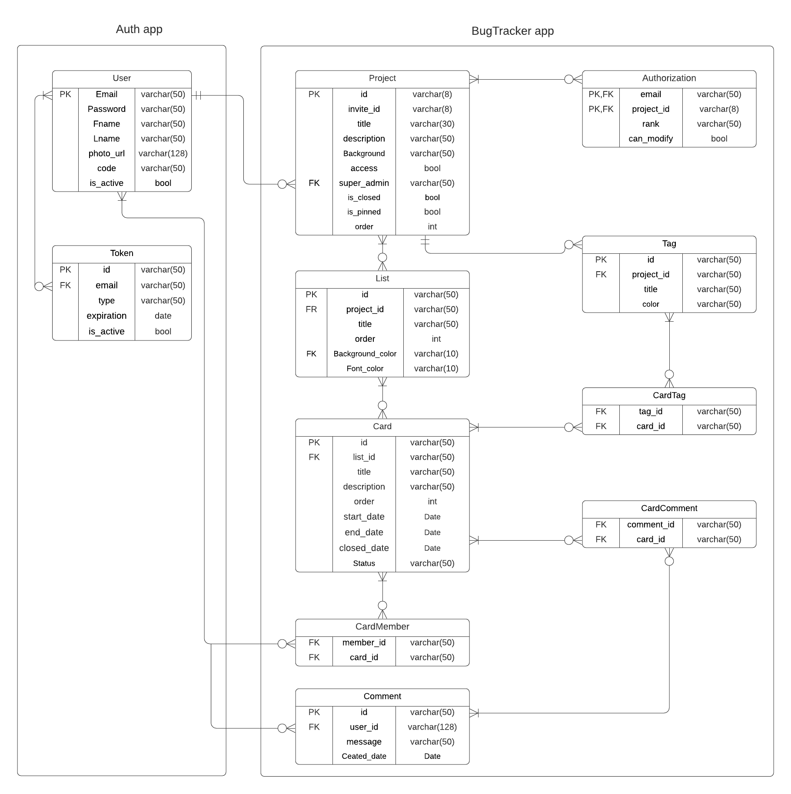

<!-- PROJECT LOGO -->

 

  
  
   
    <a href="https://bug-tracker-81cda.web.app/">View Demo</a>

## About The Project

The Bug-Tracker is a task management web app that eases the workflow and keeps track of all the tasks and bugs available in the development projects, as well as provides detailed analytics about each project.
  
### Built With:

  * [React](https://ar.reactjs.org)
  * [Django Rest API](https://www.djangoproject.com)

### Implemented Security:
  
  * JWT (JSON Web Tokens).
  * Password Hashing
  * Email Verification 
  
## ER Diagram
  
  
  
## Overall Outcomes/Achievements
  
  * Verify users by sending a verification code.
  
  

  
  

  
  

  
  

  
  * Users can create a new project with the choice of making it public or private.
  
  

  
  

  
  <ul>
    <ul>
      <li>Public project: Anyone with the project link can access the project.</li>
      <li>Private project: Only invited member can access the project.</li>
      </ul>
  </ul>
 
  * Users can access their project from "My Project" page.

  

  * Project Admin can invite users using invitation link or email, also can give permission to modify the board or set a user as a project admin.
  
  

  
  

  
  * Users can create multiple lists and cards with their own choice of colors.
  
  

  * Users can control and view detaild Information when they click on a card.
  
  

  * Project Super Admin can change the Project Setting.
  
  

  
  

  
  * Users can see detailed overview of thier own project.
  
  
